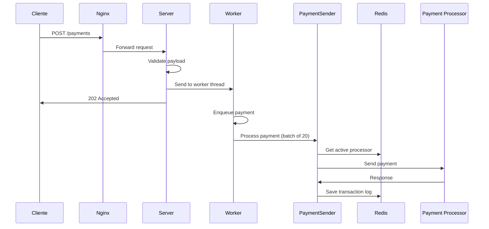
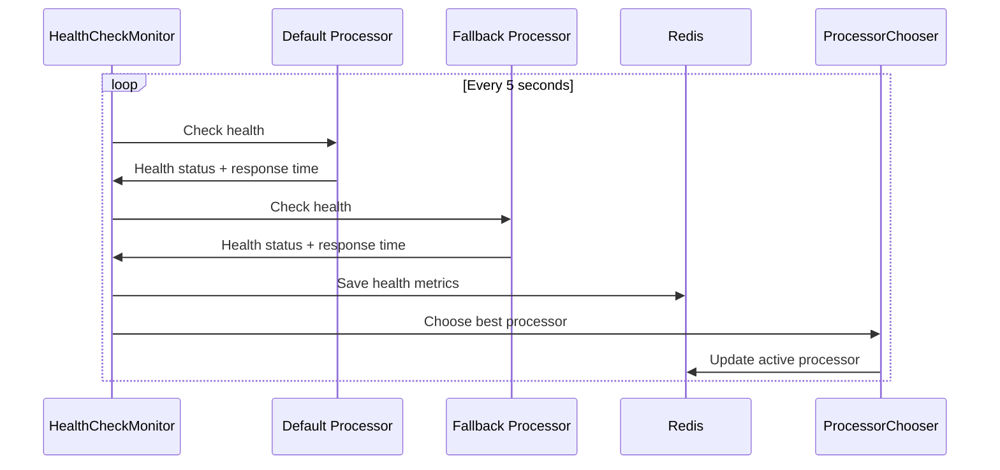
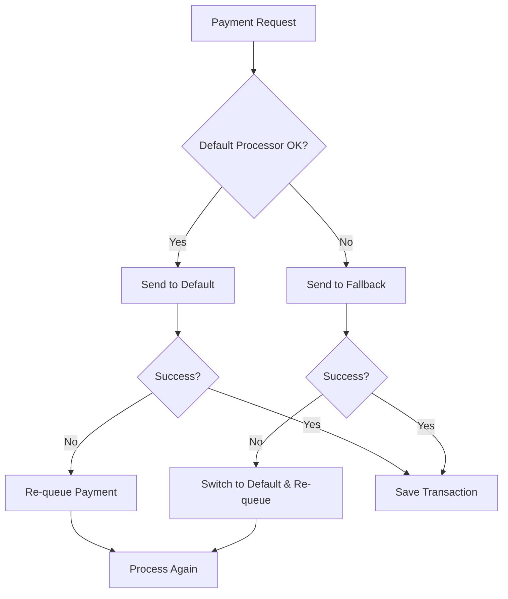

# Rinha Backend Node.js 2025

Sistema de processamento de pagamentos construído em Node.js com arquitetura resiliente e tolerante a falhas. O projeto implementa um sistema distribuído com balanceamento de carga, fallback automático entre processadores de pagamento e monitoramento de saúde.

## 📋 Sumário

- [Arquitetura do Sistema](#arquitetura-do-sistema)
- [Componentes Principais](#componentes-principais)
- [Fluxos de Negócio](#fluxos-de-negócio)
- [Endpoints da API](#endpoints-da-api)
- [Configuração e Deploy](#configuração-e-deploy)
- [Estrutura do Projeto](#estrutura-do-projeto)
- [Funcionalidades](#funcionalidades)
- [Tecnologias Utilizadas](#tecnologias-utilizadas--)

## 🏗️ Arquitetura do Sistema

O sistema é composto por múltiplas camadas que garantem alta disponibilidade e performance:

```
┌─────────────────┐    ┌──────────────┐    ┌─────────────────┐
│     Nginx       │    │   Service 1  │    │  Payment        │
│  Load Balancer  │ -> │   Service 2  │ -> │  Processors     │
│   (Port 9999)   │    │ (Port 3333)  │    │ (Default/       │
└─────────────────┘    └──────────────┘    │  Fallback)      │
                              │            └─────────────────┘
                              ▼
                       ┌──────────────┐
                       │    Redis     │
                       │   Cache      │
                       │ (Port 6379)  │
                       └──────────────┘
```

### Características da Arquitetura:

- **Load Balancer**: Nginx distribui as requisições entre múltiplas instâncias
- **Processamento Assíncrono**: Worker threads para processamento de pagamentos
- **Cache Distribuído**: Redis para estado compartilhado e logs
- **Fallback Automático**: Alternância inteligente entre processadores
- **Health Check**: Monitoramento contínuo dos serviços externos

## 🔧 Componentes Principais

### 1. **Server (src/server.js)**
- Servidor principal usando Fastify
- Gerencia as rotas da API REST
- Coordena workers e health checks
- Valida dados de entrada

### 2. **Worker (src/worker.js)**
- Processa pagamentos em thread separada
- Gerencia fila de pagamentos (Queue)
- Executa batch processing (20 pagamentos por lote)
- Comunica com processadores externos

### 3. **PaymentSender (src/PaymentSender.js)**
- Responsável pelo envio de pagamentos
- Implementa lógica de retry
- Gerencia alternância entre processadores
- Persiste transações no Redis

### 4. **HealthCheckMonitor (src/HealthCheckMonitor.js)**
- Monitora saúde dos processadores (intervalo de 5s)
- Coleta métricas de performance
- Atualiza escolha do processador ativo

### 5. **PaymentProcessorChooser (src/PaymentProcessorChooser.js)**
- Determina qual processador usar
- Considera tempo de resposta e falhas
- Atualiza configuração no Redis

### 6. **PaymentSummarizer (src/PaymentSummarizer.js)**
- Gera relatórios de transações
- Filtra por período de tempo
- Agrega dados por processador

## 🔄 Fluxos de Negócio

### Fluxo de Pagamento Principal



### Fluxo de Health Check



### Fluxo de Fallback



## 🌐 Endpoints da API

### POST /payments
Cria um novo pagamento para processamento assíncrono.

**Request Body:**
```json
{
  "correlationId": "550e8400-e29b-41d4-a716-446655440000",
  "amount": 100.50
}
```

**Validações:**
- `correlationId`: String UUID (36 caracteres)
- `amount`: Número válido

**Response:**
- `202 Accepted`: Pagamento aceito para processamento

### GET /payments-summary
Retorna resumo de pagamentos processados por período.

**Query Parameters:**
- `from`: Data/hora inicial (ISO 8601) - opcional
- `to`: Data/hora final (ISO 8601) - opcional

**Response:**
```json
{
  "default": {
    "totalRequests": 150,
    "totalAmount": 15750.5
  },
  "fallback": {
    "totalRequests": 25,
    "totalAmount": 2500.0
  }
}
```

### GET /healthcheck
Verifica se o serviço está funcionando.

**Response:**
- `200 OK`: "OK"

### POST /purge-payments
Remove todos os dados de pagamentos do Redis.

**Response:**
- `200 OK`: "OK"

## 🚀 Configuração e Deploy

### Variáveis de Ambiente

| Variável | Descrição | Padrão |
|----------|-----------|---------|
| `PAYMENT_PROCESSOR_URL_DEFAULT` | URL do processador principal | `http://localhost:8001` |
| `PAYMENT_PROCESSOR_URL_FALLBACK` | URL do processador de fallback | `http://localhost:8002` |
| `REDIS_HOST` | Host do Redis | `localhost` |
| `HEALTH_CHECK_ENABLED` | Ativa monitoramento de saúde | `false` |
| `NODE_ENV` | Ambiente de execução | `development` |

### Deploy com Docker Compose

#### Desenvolvimento Local
```bash
# Subir apenas a aplicação
docker-compose -f docker-compose-local.yml up

# Com rebuild
docker-compose -f docker-compose-local.yml up --build
```

#### Produção
```bash
# Deploy completo
docker-compose up -d

# Verificar logs
docker-compose logs -f service1 service2
```

#### Com Processadores de Pagamento
```bash
# Subir processadores externos
docker-compose -f docker-compose-payments-processors.yml up -d

# Subir aplicação principal
docker-compose up -d
```

### Desenvolvimento

```bash
# Instalar dependências
npm install

# Executar em modo desenvolvimento
npm run dev:server

# Ou executar diretamente
node src/server.js
```

## 📁 Estrutura do Projeto

```
rinha-back-node-2025/
├── src/
│   ├── ds/                     # Data Structures
│   │   ├── Queue.js           # Fila personalizada com async iterator
│   │   └── WorkerPool.js      # Pool de workers (não utilizada)
│   ├── enums/
│   │   └── PaymentProcessor.js # Enums dos processadores
│   ├── redis/
│   │   └── RedisProvider.js   # Cliente Redis customizado
│   ├── utils/
│   │   └── fetchWithTimeout.js # HTTP client com timeout
│   ├── HealthCheckMonitor.js   # Monitor de saúde
│   ├── PaymentProcessorChooser.js # Seletor de processador
│   ├── PaymentSender.js       # Enviador de pagamentos
│   ├── PaymentSummarizer.js   # Gerador de relatórios
│   ├── server.js              # Servidor principal
│   └── worker.js              # Worker de processamento
├── sql/
│   └── init.sql              # Schema SQL (referência)
├── doc/
│   └── arch.png              # Diagrama da arquitetura
├── docker-compose.yml        # Deploy produção
├── docker-compose-local.yml  # Deploy desenvolvimento
├── docker-compose-payments-processors.yml # Processadores externos
├── Dockerfile                # Imagem da aplicação
├── nginx.conf               # Configuração do load balancer
└── package.json             # Dependências e scripts
```

## ✨ Funcionalidades

### Core Features
- ✅ **Processamento Assíncrono**: Pagamentos processados em background
- ✅ **Alta Disponibilidade**: Load balancer + múltiplas instâncias
- ✅ **Fallback Automático**: Alternância entre processadores
- ✅ **Batch Processing**: Processa até 20 pagamentos por lote
- ✅ **Persistence**: Logs de transações no Redis
- ✅ **Health Monitoring**: Monitoramento contínuo de serviços

### Recursos Avançados
- ✅ **Circuit Breaker Pattern**: Falha rápida em processadores inativos
- ✅ **Smart Routing**: Escolha baseada em performance
- ✅ **Memory Efficient Queue**: Fila circular otimizada
- ✅ **Connection Pooling**: HTTP keepalive para melhor performance
- ✅ **Graceful Error Handling**: Tratamento robusto de erros
- ✅ **Observability**: Logs estruturados e métricas

### Limitações Conhecidas
- ⚠️ **Retry Logic**: Pode causar loop infinito (apenas para testes)
- ⚠️ **Queue Overflow**: Queue limitada a 10.000 items
- ⚠️ **No Persistence**: Estado perdido em restart (Redis only)

## 🛠️ Tecnologias Utilizadas

- **Runtime**: Node.js 22 (Alpine)
- **Framework**: Fastify 5.4.0
- **Cache**: Redis 5.6.0
- **HTTP Client**: Undici 7.12.0
- **Load Balancer**: Nginx
- **Containerização**: Docker + Docker Compose
- **Arquitetura**: Worker Threads, Event-Driven

## 📊 Configurações de Performance

### Resource Limits (Docker)
- **Aplicação**: 0.65 CPU, 120MB RAM por instância
- **Redis**: 0.10 CPU, 60MB RAM
- **Nginx**: 0.10 CPU, 50MB RAM

### Timeouts & Intervals
- **Payment Processor**: 10 segundos
- **Health Check**: 15 segundos
- **Health Check Interval**: 5.05 segundos
- **Redis Ping**: 5 segundos

### Queue & Batch Settings
- **Queue Size**: 10.000 items
- **Batch Size**: 20 pagamentos
- **Worker Threads**: 1 por instância

## 🔍 Monitoramento

### Health Check
- Monitora processadores a cada 5 segundos
- Coleta tempo de resposta mínimo
- Detecta falhas automáticamente
- Atualiza roteamento dinamicamente

### Logs Estruturados
- Conexões Redis
- Erros de processamento
- Timeouts de requisições
- Status dos workers

### Métricas Disponíveis
- Total de requisições por processador
- Valor total processado
- Tempo de resposta dos processadores
- Status de saúde dos serviços

---

Este projeto foi desenvolvido para a **Rinha de Backend 2025**, demonstrando técnicas avançadas de arquitetura distribuída, processamento assíncrono e resiliência em aplicações Node.js de alto desempenho.
