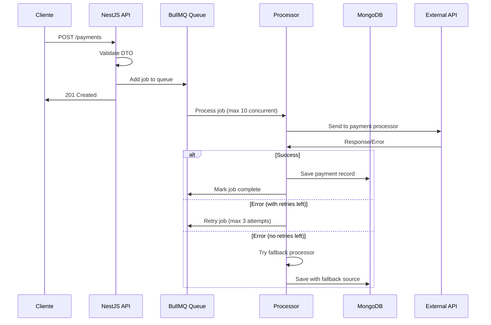
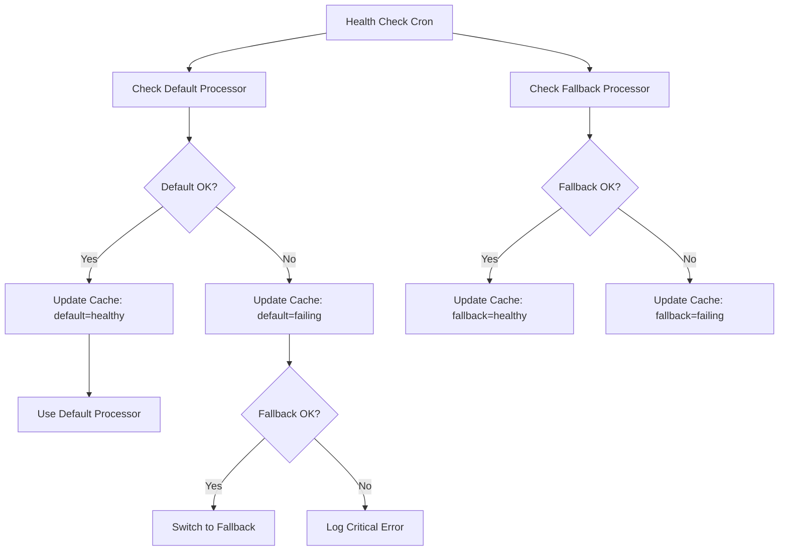
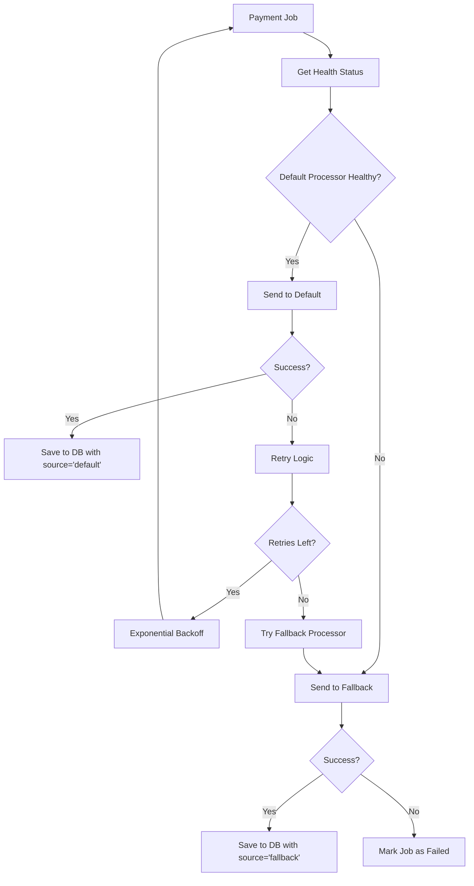

# Rinha Backend 2025 - NestJS TypeScript

Sistema avançado de processamento de pagamentos desenvolvido com **NestJS** e **TypeScript**, utilizando arquitetura modular, filas de processamento assíncrono e integração com MongoDB. Construído para alta performance e resiliência na **Rinha de Backend 2025**.

## 📋 Sumário

- [Arquitetura do Sistema](#-arquitetura-do-sistema)
- [Stack Tecnológica](#-stack-tecnológica)
- [Estrutura do Projeto](#-estrutura-do-projeto)
- [Módulos Principais](#-módulos-principais)
- [API Endpoints](#-api-endpoints)
- [Configuração e Deploy](#-configuração-e-deploy)
- [Desenvolvimento](#-desenvolvimento)
- [Fluxos de Processamento](#-fluxos-de-processamento)
- [Funcionalidades](#-funcionalidades)
- [Monitoramento e Logs](#-monitoramento-e-logs)

## 🏗️ Arquitetura do Sistema

O sistema utiliza uma arquitetura modular baseada em **Clean Architecture** e **Domain-Driven Design (DDD)**, com separação clara de responsabilidades:

```
┌─────────────────┐    ┌─────────────────┐    ┌─────────────────┐
│     Nginx       │    │   NestJS App    │    │   MongoDB       │
│  Load Balancer  │ -> │   (Fastify)     │ -> │   Database      │
│   (Port 9999)   │    │  (Port 3000)    │    │  (Port 27017)   │
└─────────────────┘    └─────────────────┘    └─────────────────┘
                              │
                              ▼
                       ┌─────────────────┐    ┌─────────────────┐
                       │     Redis       │    │  Payment        │
                       │   (BullMQ)      │ -> │  Processors     │
                       │  (Port 6379)    │    │ (External APIs) │
                       └─────────────────┘    └─────────────────┘
```

### Características Arquiteturais:

- **Modular Design**: Separação em módulos funcionais independentes
- **Dependency Injection**: IoC container do NestJS para gerenciamento de dependências
- **Queue Processing**: BullMQ com Redis para processamento assíncrono
- **Health Monitoring**: Sistema de monitoramento contínuo de serviços externos
- **Fallback Strategy**: Alternância automática entre processadores

## 🛠️ Stack Tecnológica

### Core Framework
- **NestJS** 10.x - Framework Node.js empresarial
- **TypeScript** 5.1.x - Tipagem estática e desenvolvimento robusto
- **Fastify** - HTTP server de alta performance

### Banco de Dados e Cache
- **MongoDB** 6.17.x - Banco NoSQL para persistência
- **TypeORM** 0.3.25 - ORM com suporte MongoDB
- **Redis** (Alpine) - Cache e message broker

### Processamento Assíncrono
- **BullMQ** 11.x - Sistema de filas robusto
- **@nestjs/schedule** - Cron jobs e tarefas agendadas

### Validação e Transformação
- **class-validator** - Validação de DTOs
- **class-transformer** - Serialização/Deserialização

### HTTP e Comunicação
- **Axios** - Cliente HTTP para APIs externas
- **@nestjs/axios** - Integração Axios com NestJS

### Desenvolvimento e Testes
- **Jest** - Framework de testes
- **ESLint + Prettier** - Qualidade e formatação de código
- **Supertest** - Testes de integração

## 📁 Estrutura do Projeto

```
src/
├── modules/
│   ├── payments/                    # Módulo principal de pagamentos
│   │   ├── controllers/            # Controladores REST
│   │   │   ├── create-payment/     # Criação de pagamentos  
│   │   │   ├── payments-summary/   # Relatórios e resumos
│   │   │   └── purge/              # Limpeza de dados
│   │   ├── services/               # Regras de negócio
│   │   │   ├── create-payment/
│   │   │   ├── payments-summary/
│   │   │   └── purge-payments/
│   │   ├── processors/             # Processadores de fila
│   │   │   └── process-payment.processor.ts
│   │   ├── repository/             # Camada de dados
│   │   │   ├── payment-repository.protocol.ts
│   │   │   └── payment-repository-typeorm.repository.ts
│   │   ├── adapters/               # Integrações externas
│   │   │   └── rinha-payment-processor.adapter.ts
│   │   ├── entities/               # Entidades de domínio
│   │   │   └── payment.entity.ts
│   │   ├── dtos/                   # Data Transfer Objects
│   │   │   ├── request/
│   │   │   └── response/
│   │   ├── protocols/              # Interfaces e contratos
│   │   ├── types/                  # Definições de tipos
│   │   └── payments.module.ts      # Configuração do módulo
│   │
│   ├── payment-health-check/       # Módulo de monitoramento
│   │   ├── services/               # Serviços de health check
│   │   ├── adapters/               # Adaptadores para APIs externas
│   │   ├── dtos/                   # DTOs específicos
│   │   └── protocols/              # Contratos de interface
│   │
│   └── infra/                      # Infraestrutura
│       └── database/               # Configurações de banco
│
├── exception-filters/              # Filtros de exceção globais
├── app.controller.ts              # Controlador raiz
├── app.module.ts                  # Módulo principal
└── main.ts                        # Bootstrap da aplicação
```

## 🔧 Módulos Principais

### 1. **Payments Module**
Módulo central responsável pelo processamento de pagamentos:

**Responsabilidades:**
- Recepção e validação de requisições de pagamento
- Enfileiramento para processamento assíncrono
- Integração com processadores externos
- Geração de relatórios e resumos
- Fallback automático entre processadores

### 2. **Payment Health Check Module**
Módulo de monitoramento da saúde dos processadores:

**Funcionalidades:**
- Verificação periódica de status dos processadores
- Coleta de métricas de performance
- Cache de status para otimização
- Suporte a failover automático

### 3. **Database Module**
Módulo de infraestrutura para conexão com MongoDB:

**Configurações:**
- Conexão unificada com MongoDB
- Configuração automática via environment variables
- Pool de conexões otimizado

## 🌐 API Endpoints

### POST /payments
Cria um novo pagamento para processamento assíncrono.

**Request Body:**
```json
{
  "correlationId": "550e8400-e29b-41d4-a716-446655440000",
  "amount": 100.50
}
```

**Validações:**
- `correlationId`: UUID válido (formato: xxxxxxxx-xxxx-xxxx-xxxx-xxxxxxxxxxxx)
- `amount`: Número positivo

**Response:**
```json
{
  "ok": true
}
```
- **Status:** `201 Created`

### GET /payments-summary
Retorna resumo agregado de pagamentos processados.

**Query Parameters:**
- `from`: Data inicial (ISO 8601) - opcional
- `to`: Data final (ISO 8601) - opcional

**Response:**
```json
{
  "default": {
    "totalRequests": 150,
    "totalAmount": 15750.50
  },
  "fallback": {
    "totalRequests": 25,
    "totalAmount": 2500.00
  }
}
```

### POST /purge-payments
Remove todos os dados de pagamentos do sistema.

**Response:**
- **Status:** `200 OK`

### GET /
Health check básico da aplicação.

**Response:**
```json
{
  "status": "ok"
}
```

## 🚀 Configuração e Deploy

### Variáveis de Ambiente

Crie um arquivo `.env` baseado no `.env.example`:

```bash
# Database
MONGO_URI="mongodb://localhost:27017/rinha"

# Redis
REDIS_HOST="localhost"

# Payment Processors
PAYMENT_PROCESSOR_URL_DEFAULT="http://localhost:8001"
PAYMENT_PROCESSOR_URL_FALLBACK="http://localhost:8002"

# Authentication
RINHA_TOKEN="your-secure-token-here"

# Health Check
RUNHEALTHCHECK="true"

# Application
PORT=3000
NODE_ENV="production"
```

### Deploy com Docker Compose

#### Ambiente Completo
```bash
# Subir todos os serviços
cd payment-processor-containers
docker-compose up -d

# Verificar logs
docker-compose logs -f app1 app2

# Acessar aplicação
curl http://localhost:9999
```

#### Serviços Incluídos:
- **app1, app2**: Instâncias da aplicação NestJS
- **nginx**: Load balancer (porta 9999)
- **mongodb**: Banco de dados (porta 27017)
- **redis**: Cache e filas (porta 6379)
- **mongo-express**: Interface web MongoDB (porta 8081)

### Build e Deploy Manual

```bash
# Build da aplicação
npm run build

# Executar em produção
npm run start:prod

# Desenvolvimento com hot reload
npm run start:dev

# Debug mode
npm run start:debug
```

## 💻 Desenvolvimento

### Instalação de Dependências
```bash
npm install
```

### Scripts Disponíveis

```bash
# Desenvolvimento
npm run start:dev          # Modo desenvolvimento com watch
npm run start:debug        # Modo debug com watch

# Build e Produção
npm run build              # Build da aplicação
npm run start:prod         # Execução em produção

# Qualidade de Código
npm run lint               # ESLint
npm run format             # Prettier

# Testes
npm test                   # Testes unitários
npm run test:watch         # Testes em modo watch
npm run test:cov           # Coverage report
npm run test:e2e           # Testes end-to-end
```

### Estrutura de Testes
```bash
# Testes unitários
src/**/*.spec.ts

# Testes end-to-end
test/app.e2e-spec.ts

# Configuração Jest
jest.config.js
test/jest-e2e.json
```

## 🔄 Fluxos de Processamento

### Fluxo de Criação de Pagamento



### Fluxo de Health Check



### Fluxo de Processamento com Fallback



## ✨ Funcionalidades

### Core Features
- ✅ **Processamento Assíncrono**: BullMQ com configuração avançada
- ✅ **Validação Automática**: Class-validator em todos os endpoints
- ✅ **Tratamento de Erros**: Exception filters globais
- ✅ **Health Monitoring**: Verificação contínua de processadores
- ✅ **Fallback Strategy**: Alternância automática entre serviços
- ✅ **Rate Limiting**: Controle de taxa nas filas (100 jobs/segundo)

### Recursos Avançados
- ✅ **Concorrência Controlada**: Máximo 10 jobs simultâneos
- ✅ **Retry Strategy**: 3 tentativas com backoff exponencial
- ✅ **Job Cleanup**: Remoção automática de jobs antigos
- ✅ **Connection Pooling**: Conexões otimizadas com MongoDB
- ✅ **Type Safety**: TypeScript em toda aplicação
- ✅ **Modular Architecture**: Separação clara de responsabilidades

### Configurações de Performance

#### BullMQ Settings
```typescript
{
  concurrency: 10,                    // Jobs simultâneos
  limiter: {
    max: 100,                         // Max jobs por período
    duration: 1000                    // Período em ms
  },
  defaultJobOptions: {
    attempts: 3,                      // Tentativas por job
    removeOnComplete: {
      count: 1000,                    // Manter 1000 jobs completos
      age: 3600                       // Por 1 hora
    },
    removeOnFail: true,               // Remove jobs falhados
    backoff: {
      type: 'exponential',            // Backoff exponencial
      delay: 1000                     // Delay inicial
    }
  }
}
```

#### Resource Limits
- **CPU**: 0.60 por instância
- **Memória**: 140MB por instância
- **Redis**: 0.10 CPU, 40MB RAM
- **Nginx**: 0.20 CPU, 30MB RAM

## 📊 Monitoramento e Logs

### Structured Logging
A aplicação utiliza o sistema de logs nativo do NestJS com diferentes níveis:

```typescript
// Exemplos de logs estruturados
logger.log('Payment processed successfully', { correlationId, amount, source });
logger.error('Failed to process payment', { error: error.message, stack: error.stack });
logger.debug('Adding payment to queue', { input });
logger.warn('Retrying payment processing', { attemptsMade, maxAttempts });
```

### Health Check Endpoints
- **Aplicação**: `GET /` - Status básico da API
- **MongoDB**: Verificação automática de conexão
- **Redis**: Health check integrado no Docker Compose
- **Processadores Externos**: Monitoramento via cron jobs

### Métricas Disponíveis
- Total de jobs processados
- Taxa de sucesso/falha por processador
- Tempo médio de processamento
- Utilização de recursos (CPU/Memória)
- Status de conectividade dos serviços

### Mongo Express Dashboard
Interface web disponível em `http://localhost:8081` para:
- Visualização dos dados de pagamentos
- Consultas ad-hoc no MongoDB
- Monitoramento de collections
- Análise de performance

---

## 🔍 Troubleshooting

### Problemas Comuns

1. **Erro de conexão MongoDB**
   ```bash
   # Verificar se MongoDB está rodando
   docker-compose ps mongodb
   
   # Verificar logs
   docker-compose logs mongodb
   ```

2. **Redis não conecta**
   ```bash
   # Testar conexão Redis
   redis-cli -h localhost -p 6379 ping
   
   # Verificar health check
   docker-compose ps redis
   ```

3. **Jobs não processam**
   ```bash
   # Verificar logs do processador
   docker-compose logs -f app1
   
   # Verificar fila no Redis
   redis-cli -h localhost -p 6379 KEYS "bull:*"
   ```

### Performance Tuning

1. **Ajustar concorrência**:
   ```typescript
   // src/modules/payments/processors/process-payment.processor.ts
   @Processor('process-payment-queue', {
     concurrency: 20, // Aumentar para mais throughput
   })
   ```

2. **Otimizar MongoDB**:
   ```javascript
   // Índices recomendados
   db.payment.createIndex({ "correlationId": 1 }, { unique: true })
   db.payment.createIndex({ "requestedAt": 1 })
   db.payment.createIndex({ "source": 1, "requestedAt": 1 })
   ```

Este projeto demonstra as melhores práticas de desenvolvimento com **NestJS** e **TypeScript**, implementando um sistema robusto, escalável e preparado para ambientes de produção de alta demanda.
